# Database Schema Documentation

## Schema Diagram

```mermaid
classDiagram
    %% Core Schema
    class user {
        id* uuid
        name varchar
        email* varchar
        emailVerified timestamp
        image varchar
        role* user_role
        active boolean
        permissions json
        preferences json
        lastLogin timestamp
        createdAt* timestamp
        updatedAt* timestamp
    }

    class account {
        userId* uuid
        type* varchar
        provider* varchar
        providerAccountId* varchar
        refresh_token text
        access_token text
        expires_at integer
        token_type varchar
        scope varchar
        id_token text
        session_state varchar
    }

    class session {
        sessionToken* varchar
        userId* uuid
        expires* timestamp
    }

    class systemLog {
        id* uuid
        level* log_level
        source* system_log_source
        message* text
        metadata json
        createdAt* timestamp
    }

    %% Facility Schema
    class facility {
        id* uuid
        name* varchar
        type* varchar
        address json
        license json
        capacity json
        properties json
        createdById* uuid
        createdAt* timestamp
        updatedAt* timestamp
    }

    class area {
        id* uuid
        name* varchar
        type* varchar
        facilityId* uuid
        parentId uuid
        dimensions json
        capacity json
        environment json
        status varchar
        createdById* uuid
        createdAt* timestamp
        updatedAt* timestamp
    }

    class location {
        id* uuid
        name* varchar
        type* location_type
        areaId* uuid
        coordinates json
        properties json
        capacity integer
        status varchar
        createdById* uuid
        createdAt* timestamp
        updatedAt* timestamp
    }

    %% Cultivation Schema
    class genetic {
        id* uuid
        name* varchar
        slug* varchar
        type* genetic_type
        breeder varchar
        description text
        floweringTime integer
        thcPotential decimal
        cbdPotential decimal
        terpeneProfile json
        growthCharacteristics json
        lineage json
        createdById* uuid
        createdAt* timestamp
        updatedAt timestamp
    }

    class batch {
        id* uuid
        code* varchar
        name* varchar
        geneticId uuid
        plantCount integer
        notes text
        status* batch_status
        userId* uuid
        source varchar
        stage plant_stage
        plantDate timestamp
        healthStatus health_status
        motherId uuid
        generation integer
        sex plant_sex
        phenotype varchar
        locationId uuid
        createdAt* timestamp
        updatedAt* timestamp
    }

    class plant {
        id* uuid
        code* varchar
        geneticId uuid
        batchId uuid
        source* plant_source
        stage* plant_stage
        plantDate date
        harvestDate date
        motherId uuid
        generation integer
        sex plant_sex
        phenotype varchar
        healthStatus* health_status
        quarantine boolean
        destroyReason varchar
        locationId uuid
        createdById* uuid
        createdAt* timestamp
        updatedAt timestamp
        status* varchar
    }

    %% Operations Schema
    class sensor {
        id* uuid
        name* varchar
        type* sensor_type
        model varchar
        locationId uuid
        calibrationDate date
        calibrationDue date
        accuracy decimal
        range json
        metadata json
        status varchar
        createdById* uuid
        createdAt* timestamp
        updatedAt* timestamp
    }

    class sensorReading {
        id* uuid
        sensorId* uuid
        value* decimal
        unit* varchar
        quality decimal
        metadata json
        timestamp* timestamp
    }

    class taskTemplate {
        id* uuid
        name* varchar
        category* task_category
        description text
        instructions json
        estimatedDuration integer
        requiredSkills json
        checklist json
        metadata json
        createdById* uuid
        createdAt* timestamp
        updatedAt* timestamp
    }

    class task {
        id* uuid
        templateId uuid
        assignedToId uuid
        status* task_status
        priority* task_priority
        dueDate timestamp
        completedAt timestamp
        notes text
        checklist json
        metadata json
        createdById* uuid
        createdAt* timestamp
        updatedAt* timestamp
    }

    %% Processing Schema
    class harvest {
        id* uuid
        plantId uuid
        batchId* varchar
        date* date
        wetWeight decimal
        dryWeight decimal
        trimWeight decimal
        wasteWeight decimal
        location varchar
        quality harvest_quality
        notes text
        labResults json
        status varchar
        createdById* uuid
        createdAt* timestamp
        updatedAt* timestamp
    }

    class processing {
        id* uuid
        harvestId* uuid
        type* varchar
        startDate* timestamp
        endDate timestamp
        inputWeight decimal
        outputWeight decimal
        yield decimal
        method varchar
        equipment json
        parameters json
        notes text
        labResults json
        status varchar
        createdById* uuid
        createdAt* timestamp
        updatedAt* timestamp
    }

    class complianceLog {
        id* uuid
        type* varchar
        category* varchar
        details json
        attachments json
        status varchar
        verifiedById uuid
        verifiedAt timestamp
        createdById* uuid
        createdAt* timestamp
        updatedAt* timestamp
    }

    class Note {
        id* uuid
        content* text
        type* note_type
        entityType* varchar
        entityId* uuid
        parentId uuid
        metadata json
        pinned boolean
        archived boolean
        createdById* uuid
        createdAt* timestamp
        updatedAt* timestamp
    }

    %% Core Relationships
    user --> "*" account
    user --> "*" session
    user --> "*" plant
    user --> "*" genetic
    user --> "*" Note
    user --> "*" task
    user --> "*" sensor
    user --> "*" area
    user --> "*" harvest
    user --> "*" processing

    %% Facility Relationships
    facility --> "*" area
    area --> "*" location
    area --> area
    location --> "*" plant
    location --> "*" sensor

    %% Cultivation Relationships
    genetic --> "*" plant
    genetic --> "*" batch
    batch --> "*" plant
    plant --> plant: mother
    plant --> location

    %% Operations Relationships
    sensor --> "*" sensorReading
    taskTemplate --> "*" task
    task --> user: assignedTo

    %% Processing Relationships
    harvest --> processing
    plant --> harvest

    %% Notes Relationships
    Note --> Note: parent
    Note --> user: createdBy

    %% Compliance Relationships
    complianceLog --> user: verifiedBy
```



## Schema Groups

### Core Schema

Core system functionality and authentication.

#### User Management

- **user**: Central user entity with authentication, permissions, and preferences
  - Supports role-based access control
  - Tracks user preferences and activity
  - Manages system-wide permissions

#### Authentication

- **account**: OAuth provider accounts linked to users
- **session**: Active user sessions
- **systemLog**: System-wide logging for auditing and monitoring

### Facility Management

Hierarchical structure for physical space management.

#### Facility (Top Level)

- **facility**: Physical cultivation site or building
  - Supports multiple facility types (indoor, outdoor, greenhouse)
  - Tracks licensing and compliance information
  - Manages capacity and resource planning
  - Properties include:
    - Climate control settings
    - Security configurations
    - Utility management
    - Address with GPS coordinates

#### Area (Middle Level)

- **area**: Distinct spaces within facilities
  - Examples: Veg Room, Flower Room, Mother Room
  - Supports nested areas for complex layouts
  - Tracks environmental requirements
  - Manages:
    - Physical dimensions
    - Plant capacity
    - Environmental controls
    - Resource allocation

#### Location (Bottom Level)

- **location**: Specific positions within areas
  - Precise plant placement tracking
  - Environmental monitoring points
  - Capacity management
  - Supports:
    - 3D positioning
    - Sensor placement
    - Plant tracking
    - Resource monitoring

### Cultivation Schema

Plant and genetic management.

#### Genetics

- **genetic**: Plant strain and breeding information
  - Tracks genetic lineage
  - Manages strain characteristics
  - Records growth patterns
  - Monitors potency data

#### Batches

- **batch**: Groups of plants from same genetic
  - Tracks growth cycles
  - Manages plant counts
  - Records cultivation methods
  - Monitors batch health

#### Plants

- **plant**: Individual plant tracking
  - Complete lifecycle management
  - Health monitoring
  - Location tracking
  - Genetic lineage

### Operations Schema

Day-to-day operational management.

#### Environmental Monitoring

- **sensor**: Environmental monitoring devices
  - Tracks sensor calibration
  - Manages sensor placement
  - Monitors sensor health
- **sensorReading**: Environmental data collection
  - Records measurements
  - Tracks data quality
  - Stores metadata

#### Task Management

- **taskTemplate**: Reusable task definitions
  - Standard operating procedures
  - Checklist templates
  - Resource requirements
- **task**: Assigned work items
  - Staff assignments
  - Progress tracking
  - Completion verification

### Processing Schema

Post-harvest operations and compliance.

#### Harvest Management

- **harvest**: Harvest tracking
  - Weight measurements
  - Quality assessment
  - Lab testing results
  - Location tracking

#### Processing Operations

- **processing**: Post-harvest processing
  - Processing methods
  - Yield tracking
  - Equipment usage
  - Quality control

#### Compliance

- **complianceLog**: Regulatory compliance
  - Event documentation
  - Verification tracking
  - Attachment management

### Notes Schema

Documentation and annotation system.

#### Notes

- **Note**: Multi-purpose annotation system
  - Supports multiple content types
  - Hierarchical organization
  - Entity association
  - Rich metadata

## Relationships and Dependencies

### User Relationships

- Users create and manage all major entities
- Authentication tied to user accounts
- Task assignments link to users
- Compliance verification requires user tracking

### Facility Hierarchy

- Facilities contain areas
- Areas contain locations
- Areas can have sub-areas
- Locations hold plants and sensors

### Cultivation Connections

- Genetics link to plants and batches
- Plants belong to batches
- Plants track mother plants
- Plants assigned to locations

### Operational Links

- Sensors placed in locations
- Tasks linked to templates
- Tasks assigned to users
- Readings linked to sensors

### Processing Chain

- Harvests linked to plants
- Processing linked to harvests
- Compliance logs track all operations
- Notes can reference any entity

## Best Practices

1. Always maintain referential integrity
2. Use appropriate indexes for performance
3. Include audit trails (created/updated timestamps)
4. Maintain hierarchical relationships
5. Track status changes
6. Store structured metadata in JSON fields
7. Implement proper cascading deletes
8. Use enum types for constrained values

```

```
