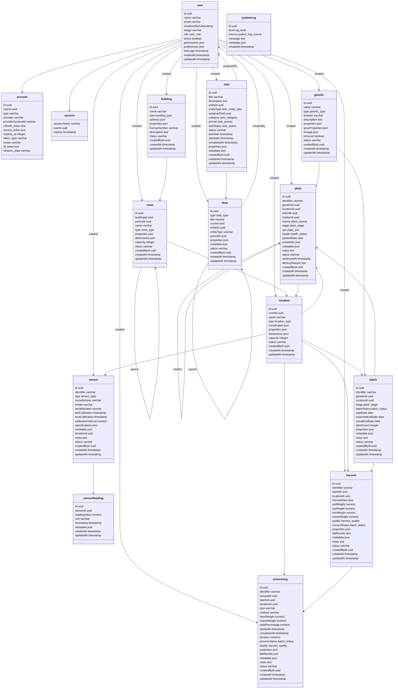

# Database Schema Documentation

## Schema Diagram

## Schema Groups

### Core Schema

Core user management and system functionality.

#### Users and Authentication

- **user**: Core user entity

  - Role-based access control
  - JSON preferences and permissions
  - Activity tracking
  - OAuth integration

- **account**: OAuth account connections

  - Multiple provider support
  - Token management
  - Provider-specific data

- **session**: User session management
  - Token-based authentication
  - Expiration tracking

#### System

- **systemLog**: System-wide logging
  - Structured logging levels
  - Source categorization
  - JSON metadata support

### Facility Schema

Physical facility and space management.

#### Buildings

- **building**: Physical structures
  - Building categorization
  - Address information
  - License management
  - Environmental controls
  - Security features

#### Rooms

- **room**: Spaces within buildings
  - Hierarchical organization (parent/child)
  - Environmental specifications
  - Dimensional tracking
  - Capacity management

#### Locations

- **location**: Specific positions
  - Precise coordinate tracking
  - Equipment placement
  - Resource allocation
  - Capacity monitoring

### Cultivation Schema

Plant cultivation and genetics management.

#### Genetics

- **genetic**: Strain/variety management
  - Detailed characteristics
  - Growth specifications
  - Lineage tracking
  - Performance metrics

#### Batches

- **batch**: Group cultivation tracking
  - Growth stage management
  - Environmental requirements
  - Resource allocation
  - Yield projections

#### Plants

- **plant**: Individual plant tracking
  - Lifecycle management
  - Health monitoring
  - Genealogy tracking
  - Growth metrics

### Operations Schema

Day-to-day operational management.

#### Sensors

- **sensor**: Environmental monitoring

  - Multiple sensor types
  - Calibration tracking
  - Specification management
  - Maintenance scheduling

- **sensorReading**: Sensor data collection
  - Time-series data
  - Measurement accuracy
  - Environmental context

#### Tasks

- **task**: Work management
  - Multi-entity association
  - Priority and status tracking
  - Assignment management
  - Checklist functionality
  - Scheduling and duration tracking

### Processing Schema

Post-harvest operations and compliance.

#### Harvests

- **harvest**: Harvest tracking
  - Weight measurements
  - Quality grading
  - Lab testing integration
  - Waste tracking
  - Yield analysis

#### Processing

- **processing**: Post-harvest processing
  - Multiple process types
  - Input/output tracking
  - Equipment utilization
  - Quality control
  - Lab result integration

### Notes Schema

Documentation and annotation system.

#### Notes

- **Note**: Multi-purpose annotation system
  - Multiple content types
  - Entity association
  - Hierarchical organization
  - Property customization
  - Metadata tracking

## Best Practices

1. Always maintain referential integrity
2. Use appropriate indexes for performance
3. Include audit trails (created/updated timestamps)
4. Maintain hierarchical relationships
5. Track status changes
6. Store structured metadata in JSON fields
7. Implement proper cascading deletes
8. Use enum types for constrained values
9. Implement proper validation at schema level
10. Maintain consistent naming conventions

## Common Patterns

1. **Tracking Fields**

   - `createdById`, `createdAt`, `updatedAt` on all tables
   - `status` enum for entity state management
   - `metadata` JSON for flexible additional data

2. **Location Hierarchy**

   - Building → Room → Location
   - Support for sub-rooms through parent/child relationships

3. **Entity References**

   - UUID primary keys
   - Consistent foreign key patterns
   - Optional parent/child relationships

4. **Property Storage**

   - Structured JSON for flexible properties
   - Typed metadata fields
   - Standardized measurement units

5. **Status Management**

   - Entity-specific status enums
   - Active/inactive flags
   - Archival support

6. **Measurement Tracking**
   - Precise numeric fields
   - Unit specification
   - Timestamp tracking
