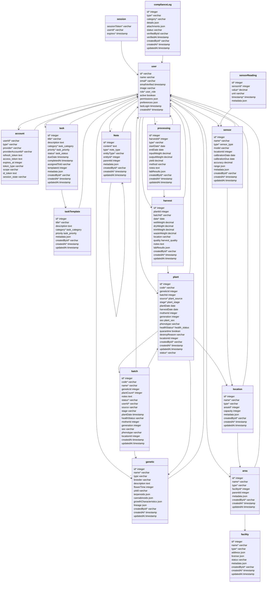

```mermaid
classDiagram
    class user {
        id* varchar
        name varchar
        email* varchar
        emailVerified timestamp
        image varchar
        role* user_role
        active boolean
        permissions json
        preferences json
        lastLogin timestamp
        createdAt* timestamp
    }

    class account {
        userId* varchar
        type* varchar
        provider* varchar
        providerAccountId* varchar
        refresh_token text
        access_token text
        expires_at integer
        token_type varchar
        scope varchar
        id_token text
        session_state varchar
    }

    class session {
        sessionToken* varchar
        userId* varchar
        expires* timestamp
    }

    class batch {
        id* integer
        code* varchar
        name* varchar
        geneticId integer
        plantCount* integer
        notes text
        status* varchar
        userId* varchar
        source varchar
        stage varchar
        plantDate timestamp
        healthStatus varchar
        motherId integer
        generation integer
        sex varchar
        phenotype varchar
        locationId integer
        createdAt timestamp
        updatedAt timestamp
    }

    class genetic {
        id* integer
        name* varchar
        type varchar
        breeder varchar
        description text
        flowerTime integer
        yield varchar
        terpenoids json
        cannabinoids json
        growthCharacteristics json
        lineage json
        createdById* varchar
        createdAt* timestamp
        updatedAt timestamp
    }

    class plant {
        id* integer
        code* varchar
        geneticId integer
        batchId integer
        source* plant_source
        stage* plant_stage
        plantDate date
        harvestDate date
        motherId integer
        generation integer
        sex plant_sex
        phenotype varchar
        healthStatus* health_status
        quarantine boolean
        destroyReason varchar
        locationId integer
        createdById* varchar
        createdAt* timestamp
        updatedAt timestamp
        status* varchar
    }

    class Note {
        id* integer
        content* text
        type* note_type
        entityType* varchar
        entityId* integer
        parentId integer
        metadata json
        createdById* varchar
        createdAt* timestamp
        updatedAt timestamp
    }

    class sensor {
        id* integer
        name* varchar
        type* sensor_type
        model varchar
        locationId integer
        calibrationDate date
        calibrationDue date
        accuracy decimal
        range json
        metadata json
        createdById* varchar
        createdAt* timestamp
        updatedAt timestamp
    }

    class sensorReading {
        id* integer
        sensorId* integer
        value* decimal
        unit varchar
        timestamp* timestamp
        metadata json
    }

    class task {
        id* integer
        title* varchar
        description text
        category* task_category
        priority* task_priority
        status* task_status
        dueDate timestamp
        completedAt timestamp
        assignedToId varchar
        templateId integer
        metadata json
        createdById* varchar
        createdAt* timestamp
        updatedAt timestamp
    }

    class taskTemplate {
        id* integer
        title* varchar
        description text
        category* task_category
        priority task_priority
        metadata json
        createdById* varchar
        createdAt* timestamp
        updatedAt timestamp
    }

    class harvest {
        id* integer
        plantId integer
        batchId* varchar
        date* date
        wetWeight decimal
        dryWeight decimal
        trimWeight decimal
        wasteWeight decimal
        location varchar
        quality harvest_quality
        notes text
        labResults json
        createdById* varchar
        createdAt* timestamp
        updatedAt timestamp
    }

    class processing {
        id* integer
        harvestId* integer
        type* varchar
        startDate* date
        endDate date
        inputWeight decimal
        outputWeight decimal
        yield decimal
        method varchar
        notes text
        labResults json
        createdById* varchar
        createdAt* timestamp
        updatedAt timestamp
    }

    class complianceLog {
        id* integer
        type* varchar
        category* varchar
        details json
        attachments json
        status varchar
        verifiedById varchar
        verifiedAt timestamp
        createdById* varchar
        createdAt* timestamp
        updatedAt timestamp
    }

    class facility {
        id* integer
        name* varchar
        type* varchar
        address json
        license json
        status varchar
        metadata json
        createdById* varchar
        createdAt* timestamp
        updatedAt timestamp
    }

    class area {
        id* integer
        name* varchar
        type* varchar
        facilityId* integer
        parentId integer
        metadata json
        createdById* varchar
        createdAt* timestamp
        updatedAt timestamp
    }

    class location {
        id* integer
        name* varchar
        type* varchar
        areaId* integer
        capacity integer
        metadata json
        createdById* varchar
        createdAt* timestamp
        updatedAt timestamp
    }

    user --> "*" account
    user --> "*" plant
    user --> "*" genetic
    user --> "*" Note
    user --> "*" task
    user --> "*" sensor
    user --> "*" area
    user --> "*" harvest
    user --> "*" processing
    account --> user
    session --> user
    batch --> genetic
    batch --> user
    batch --> plant
    genetic --> user
    plant --> genetic
    plant --> batch
    plant --> user
    plant --> location
    Note --> user
    Note --> Note
    sensor --> location
    sensor --> user
    sensorReading --> sensor
    task --> user
    task --> taskTemplate
    taskTemplate --> user
    harvest --> plant
    harvest --> user
    processing --> harvest
    processing --> user
    complianceLog --> user
    area --> facility
    area --> user
    location --> area
    location --> user
```
