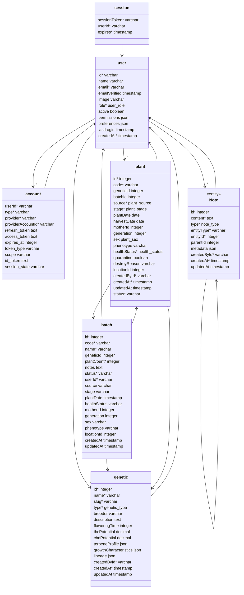

```mermaid
classDiagram
    class user {
        id* varchar
        name varchar
        email* varchar
        emailVerified timestamp
        image varchar
        role* user_role
        active boolean
        permissions json
        preferences json
        lastLogin timestamp
        createdAt* timestamp
    }
    
    class account {
        userId* varchar
        type* varchar
        provider* varchar
        providerAccountId* varchar
        refresh_token text
        access_token text
        expires_at integer
        token_type varchar
        scope varchar
        id_token text
        session_state varchar
    }
    
    class session {
        sessionToken* varchar
        userId* varchar
        expires* timestamp
    }
    
    class batch {
        id* integer
        code* varchar
        name* varchar
        geneticId integer
        plantCount* integer
        notes text
        status* varchar
        userId* varchar
        source varchar
        stage varchar
        plantDate timestamp
        healthStatus varchar
        motherId integer
        generation integer
        sex varchar
        phenotype varchar
        locationId integer
        createdAt timestamp
        updatedAt timestamp
    }
    
    class genetic {
        id* integer
        name* varchar
        slug* varchar
        type* genetic_type
        breeder varchar
        description text
        floweringTime integer
        thcPotential decimal
        cbdPotential decimal
        terpeneProfile json
        growthCharacteristics json
        lineage json
        createdById* varchar
        createdAt* timestamp
        updatedAt timestamp
    }
    
    class plant {
        id* integer
        code* varchar
        geneticId integer
        batchId integer
        source* plant_source
        stage* plant_stage
        plantDate date
        harvestDate date
        motherId integer
        generation integer
        sex plant_sex
        phenotype varchar
        healthStatus* health_status
        quarantine boolean
        destroyReason varchar
        locationId integer
        createdById* varchar
        createdAt* timestamp
        updatedAt timestamp
        status* varchar
    }
    
    class Note {
        id* integer
        content* text
        type* note_type
        entityType* varchar
        entityId* integer
        parentId integer
        metadata json
        createdById* varchar
        createdAt* timestamp
        updatedAt timestamp
    }
    <<entity>> Note

    user --> "*" account
    user --> "*" plant
    user --> "*" genetic
    user --> "*" Note
    account --> user
    session --> user
    batch --> genetic
    batch --> user
    batch --> plant
    genetic --> user
    plant --> genetic
    plant --> batch
    plant --> user
    Note --> user
    Note --> Note
```
