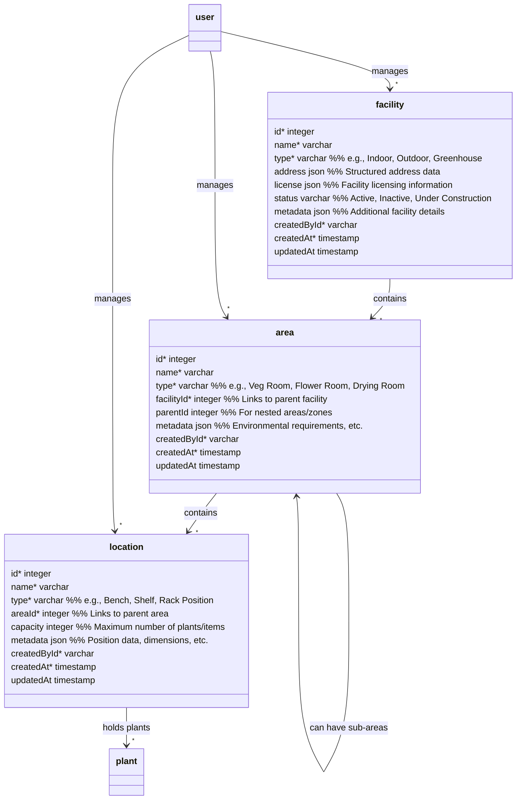

# Facility Management Hierarchy

## Facility (Top Level)

- Represents a physical cultivation site or building
- Can be a greenhouse, indoor grow, outdoor field, processing facility, etc.
- Has licensing and address information
- Contains multiple areas

## Area (Middle Level)

- Represents distinct spaces within a facility
- Examples: Veg Room, Flower Room, Mother Room, Drying Room, Processing Area
- Can have sub-areas (using parentId) for more granular organization
- Contains multiple locations
- Typically has specific environmental controls/requirements

## Location (Bottom Level)

- Represents specific positions within an area
- Examples: Bench #1, Shelf A, Drying Rack 3
- Has defined capacity for plants/items
- Most granular level of physical organization
- Where individual plants are actually placed

## Benefits of this Structure

- Precise tracking of plant locations
- Environmental control at different levels
- Capacity planning and space management
- Compliance with regulatory requirements for plant tracking
- Flexible organization of growing spaces
